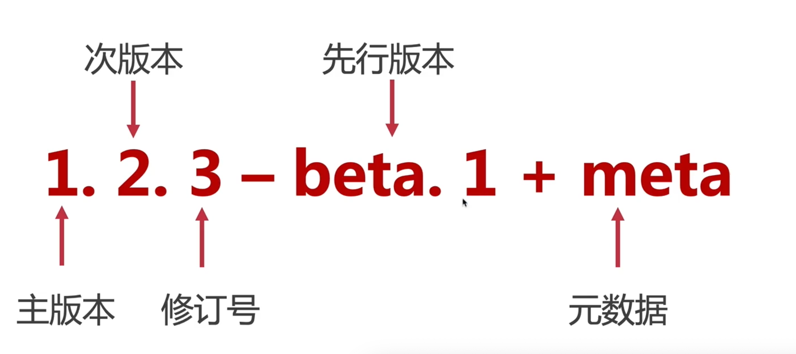
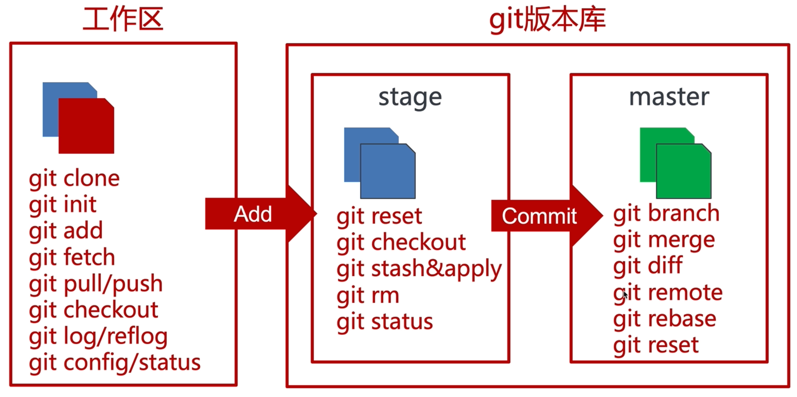

# Git

### 简介
Git是目前世界上最先进的分布式版本控制系统。

###### 语义化版本

* alpha      内部测试版本,除非是内部测试人员.否则不推荐使用,有很多bug
* beta       公测版本,消除了严重的错误,还是会有缺陷,这个阶段还会持续的加入新的功能
* rc         Release Candidate,发型候选版本,这个版本不会加入新的功能,主要是排错,修改bug
* release    正式版本 

### 命令行

git工作区相关指令
git init                            初始化git仓库
git clone                           克隆远程仓库
git add                             添加内容到缓存区
git status
git fetch
git pull
git push
git checkout 
git log                             查看提交日志
git reflog                          输出每一次操作记录
git config

git版本
git reset
git remote  
git remote -v           远程分支的绑定
git branch                      查看本地分支
git checkout -v

### 技巧
###### 添加远程仓库地址
git remote add origin git@github.com:az1802/gittest.git

git push -u origin master   

###### 修改提交的信息
git commit --amend -m "new message"

###### git 添加子模块

###### git remote
1.git remote 不带参数，列出已经存在的远程分支
2.git remote -v | --verbose 列出详细信息，在每一个名字后面列出其远程url，此时， -v 选项(译注:此为 –verbose 的简写,取首字母),显示对应的克隆地址。
3.git remote add url   添加一个远程仓库

### 原理
当在一个新目录或已有目录执行 git init 时，Git 会创建一个 .git 目录。 这个目录包含了几乎所有 Git 存储和操作的东西。 如若想备份或复制一个版本库，只需把这个目录拷贝至另一处即可。 本章探讨的所有内容，均位于这个目录内。 新初始化的 .git 目录的典型结构如下：
config                      文件包含项目特有的配置选项。
description                 文件仅供 GitWeb 程序使用，我们无需关心
HEAD                        文件指向目前被检出的分支
hooks/                      包含客户端或服务端的钩子脚本（hook scripts）
info/                       目录包含一个全局性排除（global exclude）文件， 用以放置那些不希望被记录在 .gitignore 文件中的忽略模式（ignored patterns）
objects/                    存储所有数据内容
refs/                       目录存储指向数据（分支、远程仓库和标签等）的提交对象的指针；
index                       文件保存暂存区信息。

git 对象
Git 是一个内容寻址文件系统，听起来很酷。但这是什么意思呢？ 这意味着，Git 的核心部分是一个简单的键值对数据库（key-value data store）。 你可以向 Git 仓库中插入任意类型的内容，它会返回一个唯一的键，通过该键可以在任意时刻再次取回该内容。

### 面试
###### git 和 svn的区别
1. Git是一个分布式的版本控制工具	1. SVN 是集中版本控制工具
2.它属于第3代版本控制工具	2.它属于第2代版本控制工具
3.客户端可以在其本地系统上克隆整个存储库	3.版本历史记录存储在服务器端存储库中
4.即使离线也可以提交	4.只允许在线提交
5.Push/pull 操作更快	5.Push/pull 操作较慢
6.工程可以用 commit 自动共享	6.没有任何东西自动共享

###### Git 是用什么语言编写的？
Git使用 C 语言编写。 GIT 很快，C 语言通过减少运行时的开销来做到这一点。
###### 在Git中，你如何还原已经 push 并公开的提交？
1 删除或修复新提交中的错误文件，并将其推送到远程存储库。这是修复错误的最自然方式。对文件进行必要的修改后，将其提交到我将使用的远程存储库
    git commit -m "commit message"
2 创建一个新的提交，撤消在错误提交中所做的所有更改。可以使用命令
    git revert <name of bad commit>

###### git rebase 和 git merge 有什么区别？

###### git pull 和 git fetch 有什么区别？
git pull 命令从中央存储库中提取特定分支的新更改或提交，并更新本地存储库中的目标分支。

git fetch 也用于相同的目的，但它的工作方式略有不同。当你执行 git fetch 时，它会从所需的分支中提取所有新提交，并将其存储在本地存储库中的新分支中。如果要在目标分支中反映这些更改，必须在 git fetch 之后执行git merge。只有在对目标分支和获取的分支进行合并后才会更新目标分支。为了方便起见，请记住以下等式：

<h5>git pull = git fetch + git merge</h5>

###### 什么是 Git 中的“裸存储库”？
Git 中的 “裸” 存储库只包含版本控制信息而没有工作文件（没有工作树），并且它不包含特殊的 .git 子目录。相反，它直接在主目录本身包含 .git 子目录中的所有内容，其中工作目录包括：

一个 .git 子目录，其中包含你的仓库所有相关的 Git 修订历史记录。
工作树，或签出的项目文件的副本。

###### Git的3个工作目录和4种状态?
4中状态      未被跟踪  未修改 已经修改   进入到缓存区
3个工作目录   工作区   缓存区  仓库 

###### 什么是 git stash?
通常情况下，当你一直在处理项目的某一部分时，如果你想要在某个时候切换分支去处理其他事情，事情会处于混乱的状态。问题是，你不想把完成了一半的工作的提交，以便你以后就可以回到当前的工作。解决这个问题的答案是 git stash。

###### 怎样将 N 次提交压缩成一次提交？
将N个提交压缩到单个提交中有两种方式：

如果要从头开始编写新的提交消息，请使用以下命令：
git reset –soft HEAD~N &&
git commit
如果你想在新的提交消息中串联现有的提交消息，那么需要提取这些消息并将它们传给 git commit，可以这样：
git reset –soft HEAD~N &&
git commit –edit -m"$(git log –format=%B –reverse .HEAD@{N})"
###### 描述一下你所使用的分支策略？
功能分支（Feature branching）
要素分支模型将特定要素的所有更改保留在分支内。当通过自动化测试对功能进行全面测试和验证时，该分支将合并到主服务器中。

任务分支（Task branching）
在此模型中，每个任务都在其自己的分支上实现，任务键包含在分支名称中。很容易看出哪个代码实现了哪个任务，只需在分支名称中查找任务键。

发布分支（Release branching）
一旦开发分支获得了足够的发布功能，你就可以克隆该分支来形成发布分支。创建该分支将会启动下一个发布周期，所以在此之后不能再添加任何新功能，只有错误修复，文档生成和其他面向发布的任务应该包含在此分支中。一旦准备好发布，该版本将合并到主服务器并标记版本号。此外，它还应该再将自发布以来已经取得的进展合并回开发分支。

###### git进行撤销操作.
在 Git 中可以用来撤销操作，分别是 git reset、git revert
git reset它能够同时作用于 Commit 和文件，用来撤销还没有提交到远程仓库的改动。git reset 会移动 HEAD 的位置，并且还可以变更暂存区和工作区，该操作有三个选项：
--soft：该选项会修改 HEAD 位置，而工作区和暂存区不会有变化
--mixed：默认选项，会修改 HEAD 位置以及暂存区，而工作区不会有变化
--hard：修改 HEAD 位置，暂存区和工作区都会被更新到指定 Commit 的状态

git revert该操作只能作用于 Commit，而不能作用于文件。同时，该操作会创建一个新的 Commit 来撤销之前提交的更改，它不会去修改现有的历史记录。

###### 如何解决冲突 
1 操作就是把自己修改的代码隐藏，然后把远程仓库的代码拉下来，然后把自己隐藏的修改的代码释放出来，让 git 自动合并。接着找 <<<<<<<, 哪里冲突哪里改。
git stash 
git pull 
git stash pop 

2 前面两招挺管用的，场景就是合作的远程仓库上，别人做了一些改动，我没有 commit , 然后把别人的 commit 拉下来。
git reset --hard commit_id
git pull

3 git reset commit id 的作用是取消暂存文件。将 HEAD 的指针指向 commit id，修改了暂存区域 Staging Area 和版本库 Commit History，工作区沙盒 Working Directory 保持原样。
git reset commit_id
git stash 
git pull 
git stash pop  

###### git revert 和 git reset ?
git revert 和 git reset 的目的是一样的，但是做法不同，它会以创建新的 commit 的方式来撤销 commit，这样能保留之前的 commit 历史，比较安全。另外，同样因为可能会覆盖本地的修改，所以执行这个指令之前，你需要 stash 或者 commit 暂存区和工作区的更改。

###### 多个提交历史合并为一个简化提交信息
###### 
###### 
###### 多个仓库的推送

log reflog  stash