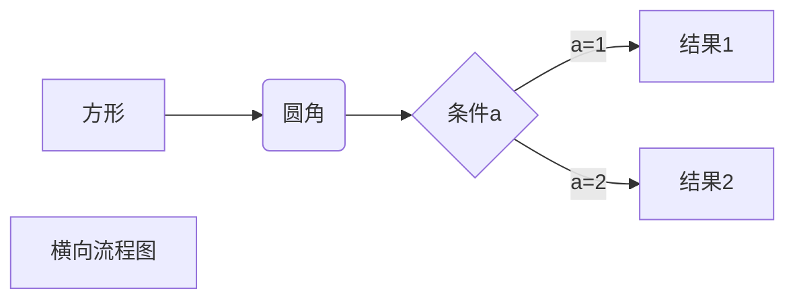
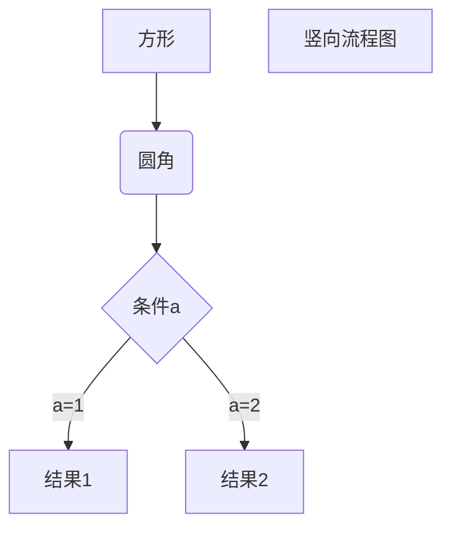
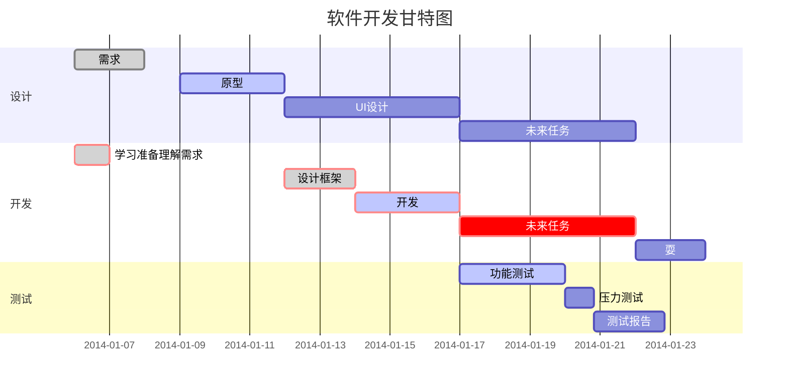

# MarkDown语法
### 标题语法# 文字
# 一级标题
## 二级标题
### 三级标题
#### 四级标题
##### 五级标题
###### 六级标题

****

### 字体
*斜体*
**粗体**
***粗斜***
~~删除~~
<u>下划线</u>
`标注`


****

### 列表
\*作为标记
* 列表一
* 列表二

数字1. 作为标记

1. 列表一
2. 列表二
   * 子列表

*****

### 区块引用
> 区块引用
> > 子区块隐痛

*****

###代码

```javascript
function say(){
    console.log("hello world")
}
```
*****

###连接
[百度](https://www.baidu.com])
https://www.baidu.com


###图片


###表格
|  表头   | 表头  |
|  ----  | ----  |
| 单元格  | 单元格 |
| 单元格  | 单元格 |

###使用html标签
使用 <kbd>Ctrl</kbd>+<kbd>Alt</kbd>+<kbd>Del</kbd> 重启电脑

###数学公式
$$
\mathbf{V}_1 \times \mathbf{V}_2
$$


###流程图

####横向流程图


####竖向流程图


####标准流程图
```flow
st=>start: 开始框
op=>operation: 处理框
cond=>condition: 判断框(是或否?)
sub1=>subroutine: 子流程
io=>inputoutput: 输入输出框
e=>end: 结束框
st->op->cond
cond(yes)->io->e
cond(no)->sub1(right)->op
```

####UML时序图
```sequence
Title: 标题：复杂使用
对象A->对象B: 对象B你好吗?（请求）
Note right of 对象B: 对象B的描述
Note left of 对象A: 对象A的描述(提示)
对象B-->对象A: 我很好(响应)
对象B->小三: 你好吗
小三-->>对象A: 对象B找我了
对象A->对象B: 你真的好吗？
Note over 小三,对象B: 我们是朋友
participant C
Note right of C: 没人陪我玩
```

####甘特图



###end
关于表格和时序图等不建议使用md,过于复杂
