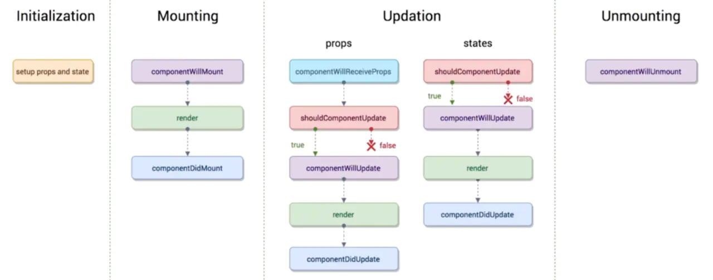
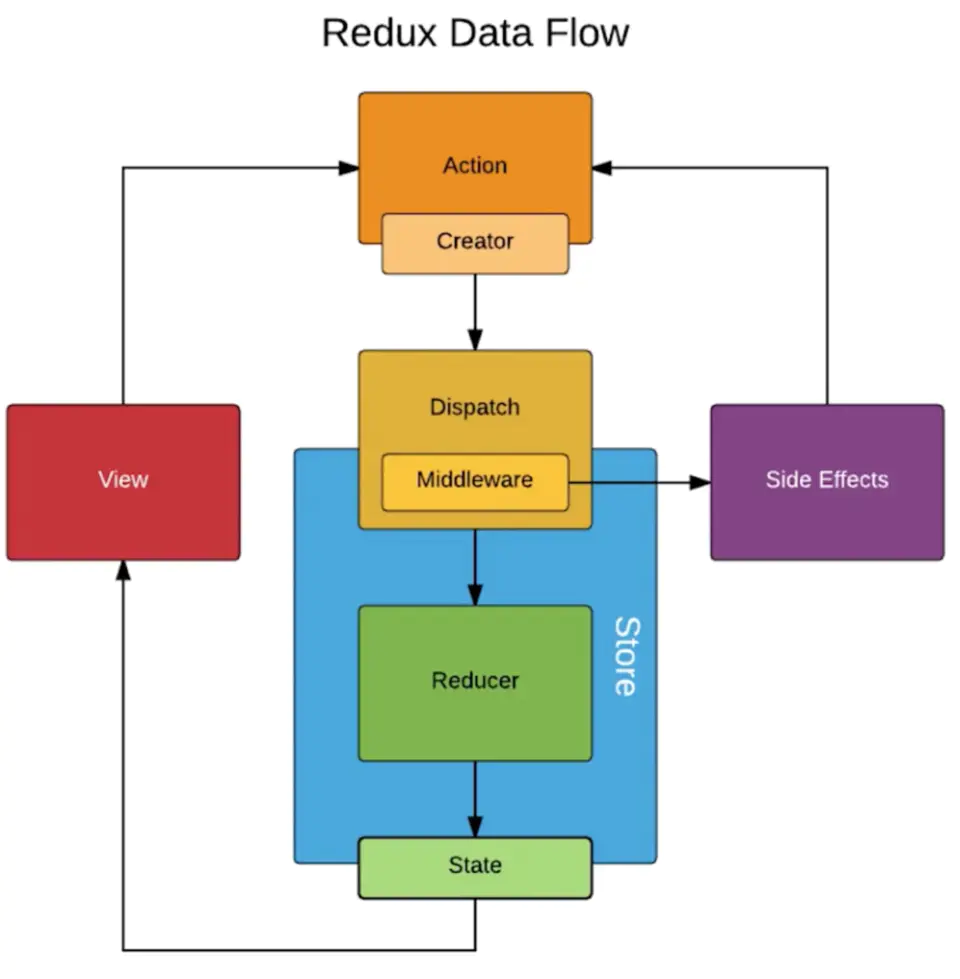

# React


### React原理相关
1 数据驱动视图,唯一更改视图的方法setState

### React事件机制
1 所有事件挂载到 document 上
2 event 不是原生的，是SyntheticEvent合成事件对象
3 与 Vue 事件不同，和 DOM 事件也不同
使用合成事件的好处
1 更好的兼容性和跨平台，摆脱传统DOM事件
2 挂载到document，减少内存消耗，避免频繁解绑
3 方便事件的统一管理，如：事务机制

### React batchUpdaye批量更新


### React生命周期

初始化  constructor()
绑定    componentWillMount  render  componentDidMount(数据请求可以放在此处)
更新    componentWillReceiveProps(props的更新,只要父组件执行render,子组件就会执行,子组件初始化不会执行)   shouldComponentUpdate  componentWillUpdate render componentDidUpdate
解绑    componentWillUnmount  

即将废除的生命周期和新增的生命周周期


##### React性能优化
1 在页面中使用了setTimout()、addEventListener()等，要及时在componentWillUnmount()中销毁
2 使用异步组件
3 使用 React-loadable 动态加载组件
4 shouldComponentUpdate(简称SCU )、React.PureComponent、React.memo
5 不可变值 ImmutableJS
6 immutable.js的应用
7 渲染列表加key


##### React diff原理
1 把树形结构按照层级分解，只比较同级元素。
2 给列表结构的每个单元添加唯一的 key 属性，方便比较。
3 React 只会匹配相同class的component（这里面的class指的是组件的名字）
4 合并操作，调用 component 的 setState 方法的时候, React 将其标记为 dirty.到每一个事件循环结束, React检查所有标记 dirty 的 component 重新绘制.
5 选择性子树渲染。开发人员可以重写 shouldComponentUpdate 提高 diff 的性能。

##### React ref
1 ref可以为普通字符串
2 ref为箭头函数

##### React  class构造组件和函数构造组件的区别
1 函数组件看似只是一个返回值是DOM结构的函数，其实它的背后是无状态组件的思想。
2 函数组件中，你无法使用State，也无法使用组件的生命周期方法，这就决定了函数组件都是展示性组件，接收Props，渲染DOM，而不关注其他逻辑
3 函数组件中没有this
4 函数组件更容易理解。当你看到一个函数组件时，你就知道它的功能只是接收属性，渲染页面，它不执行与UI无关的逻辑处理，它只是一个纯函数。而不用在意它返回的DOM结构有多复杂。


##### setState使用注意事项
传入对象会被合并执行一次。
传入函数不会被合并异步的进行运行将返回值进行合并主要用于异步的情形

1 不可变值
2 可能是异步更新
3 可能会被合并
```javascript
// 不能使用 push pop splice 等，这样违反了不可变值，会影响 shouldCompententUpdate 判断
this.setState(() => ({
    list1: this.state.list1.concat(100), // 追加
    list2: [...this.state.list2, 100], // 追加
    list3: this.state.list3.slice(0, 3) // 截取
    list4: this.state.list4.filter(item => item > 100) // 筛选
}))

// 正确使用
this.setState(() => ({
    obj1: Object.assign({}, this.state.obj1, {a: 100}),
    obj2: {...this.state.obj2, a: 100}
}))
```

##### 常见组件类型
###### 无状态组件
1 纯函数
2 输入props，输出JSX
3 没有实例
4 没有生命周期
5 没有state
6 不能扩展其它方法

###### 非受控组件
在大多数情况下，我们推荐使用 受控组件 来处理表单数据。在一个受控组件中，表单数据是由 React 组件来管理的。另一种替代方案是使用非受控组件，这时表单数据将交由 DOM 节点来处理。
```javascript   
// 非受控组件
 <input defaultValue={this.state.name} ref={this.nameInputRef} />
<input type="text" ref={this.input} />
// 受控组件
<input type="text" value={this.state.name} />
```
###### portals 传送门
尽管 portal 可以被放置在 DOM 树中的任何地方，但在任何其他方面，其行为和普通的 React 子节点行为一致。由于 portal 仍存在于 React 树， 且与 DOM 树 中的位置无关，那么无论其子节点是否是 portal，像 context 这样的功能特性都是不变的。
```javascript   
class portalCom extends Component{
    render(){
        return ReactDOM.createPortal(
            (<div>挂载到body下</div>),
            document.body
    );
    }
}
```

###### context
当 Provider 的 value 值发生变化时，它内部的所有消费组件都会重新渲染。Provider 及其内部 consumer 组件都不受制于 shouldComponentUpdate 函数，因此当 consumer 组件在其祖先组件退出更新的情况下也能更新。
注意事项
因为 context 会使用参考标识（reference identity）来决定何时进行渲染，这里可能会有一些陷阱，当 provider 的父组件进行重渲染时，可能会在 consumers 组件中触发意外的渲染。举个例子，当每一次 Provider 重渲染时，以下的代码会重渲染所有下面的 consumers 组件，因为 value 属性总是被赋值为新的对象
```javascript
class App extends React.Component {
  render() {
    return (
      <MyContext.Provider value={{something: 'something'}}>
        <Toolbar />
      </MyContext.Provider>
    );
  }
}
// 防止无意义的渲染需要将value的状态提升到父节点的state里
class App extends React.Component {
  constructor(props) {
    super(props);
    this.state = {
      value: {something: 'something'},
    };
  }

  render() {
    return (
      <Provider value={this.state.value}>
        <Toolbar />
      </Provider>
    );
  }
}
```

###### 异步组件
fallback请求未完成时显示ID内容
```javascript
const LazyComponent = React.lazy(() => import('./components/ParentCom/AsyncCom'))
<Suspense fallback={<div>异步组件加载中.....</div>}>
    <LazyComponent></LazyComponent>
</Suspense>
```


###### 高阶组件
高阶组件（HOC）是 React 中用于复用组件逻辑的一种高级技巧。HOC 自身不是 React API 的一部分，它是一种基于 React 的组合特性而形成的设计模式。具体而言，高阶组件是参数为组件，返回值为新组件的函数。请注意，HOC 不会修改传入的组件，也不会使用继承来复制其行为。相反，HOC 通过将组件包装在容器组件中来组成新组件。HOC 是纯函数，没有副作用。
不要在 render 方法中使用 HOC。因为react内部使用===来判断组件是否可以进行复用。不能复用则会完全的卸载掉重新渲染.不仅对性能有影响而且会丢失子组件的状态

###### render props
Render Props 核心思想：通过一个函数将 class 组件的 state 作为 props 传递给纯函数组件
```javascript
class Factory extends React.Component {
    constructor () {
        this.state = {
            /* 这里 state 即多个组件的公共逻辑的数据 */
        }
    }
    /* 修改 state */
    render () {
        return <div>{this.props.render(this.state)}</div>
    }
}

const App = () => {
    /* render 是一个函数组件 */
    <Factory render={
        (props) => <p>{props.a} {props.b}...</p>
    } />
}
```


##### Redux
单项数据流

1 dispatch(action)
2 reducer产生新的state
3 subscrible进行订阅,发生更新时触发回调

##### ReduxRouter
1 hash模式
2 history模式
3 memory模式

```javascript
import {
    HashRouter,
    BrowserRouter,
    Switch,
    Link,
    Route
} from 'react-router-dom'
// 最外层HashRouter表示路由的模式
// Link负则路由跳转
// Route负责对应路径显示的组件内容
function RouterComponent () {
    return (
        <BrowserRouter>
            <Switch>
                <Route path='/' exact component={Home}>
                {/* 动态路由 */}
                <Route path='/detail/:id' exact component={Detail}></Route>
                {/* 匹配404等页面 */}
                <Route path='*' exact component={NotFound}></Route>
            </Switch>
        </BrowserRouter>
    )
}
```
